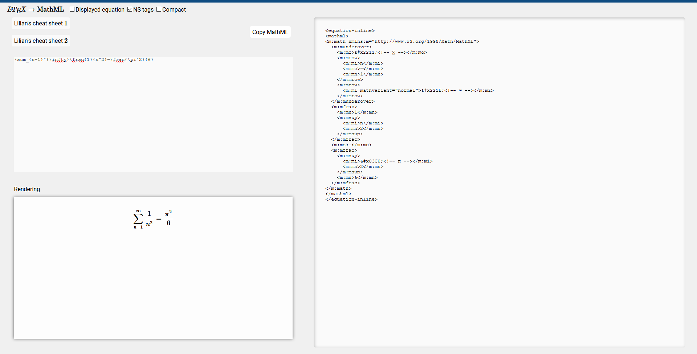

# LaTeX2MathML

HTML page with Javascript that uses MathJax to transform LaTeX to MathML to input into DITA

You can download this page by running

```
git clone git@code.ssnc.global:Franklin.Pacheco/latex2mathml.git
```

You will see a directory called `latex2mathml`. Open the page `LaTeX2MathML.html` in a browser.
The conversion is done by making requests to cdnjs.cloudflare.com, which runs the MathJax script.
So, it requires internet connection.

## To use offline

If you prefer all the work to be done locally, run

```
git checkout offline
```

You will see now a directory called `MathJax-2.7.1`.
The page will use now the script in this diretory.


# To use the page

 * Type LaTeX equations in the top-left textbox.
 * The equation will be displayed in box below it.
 * The MathML appears on the right.
 * Check **Displayed equation** if you need the MathML for an equation that appears on its own line. Uncheck it for equations that appear inside a line, together with other text.
 * Check **NS tags** for the MathML to have the `m:` namespace tag. We need this for our DITA documents.
 * Check **Compact** to get the MathML in a single line. 
 * The two buttons **Lilian's cheat sheet 1** and **Lilian's cheat sheet 2** display a cheat sheet with some basics of LaTeX. To close them click on the cheat sheet. If you need the cheat sheets to look bigger double-click the buttons instead.
 * The last equation that you typed gets saved in the local storage of your browser. So, if you re-open or refresh the page it will still be there.
 * One can either select the MathML and copy it, or just press the button **Copy MathML**.
 * The MathML can then be pasted in the DITA file. If using Oxygen, it must be pasted in *Text* mode, not in *Author* mode.

## Screeshot


